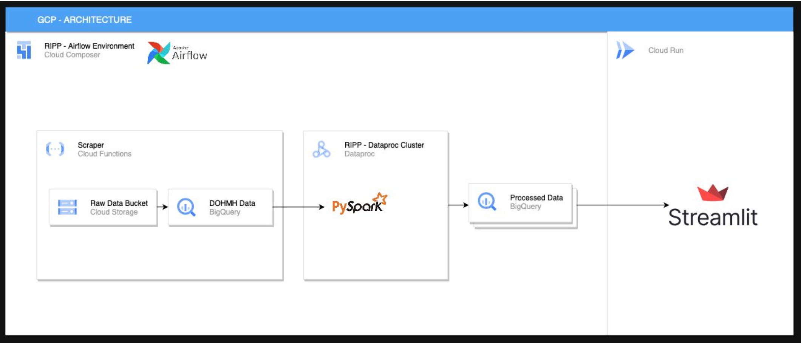

# Analyzing NYC Restaurant Inspections: Patterns and Predictions

### Why?

Open portal that can foster collaboration between inspection officers, restaurant owners, regulators to improve diner’s
experience and ultimately the protect public health.

### Objectives

- Understand how restaurant violation results have changed over the years and across seasons.
- Violation codes and their relationship with factors like cuisine type, borough, season.
- Discover patterns across a restaurant chains.

### Dataset

DOHMH New York City Restaurant Inspection Results:

- Inspection results for restaurants across NYC
- Source: NYC Open Data
- ~210K rows, 27 columns
- API endpoint available

Keys points to note:

- Conditional temporal analysis is allowed.
- Violation codes, scores & grades(may) are assigned after inspection.
- API record limit of 50K per request (Requires Pagination)

### Architecture

#### Google Cloud Platform

#### Ariflow DAGs

### Analysis

1. Geospatial analysis of the most recent grade given to a restaurant.
    - Find the most recent inspection results for each restaurant based and filter using instructions defined by NYC
      Open Data (such as score value, type of instruction and grade allowed).
    - Using this ‘most_recent_letter_grade’ dataframe build a map using ‘folium’
    - ‘Most_recent_letter_grade’ is used as the reference dataframe for all future analysis.
      

1. Restaurant chain analysis
    - Chain-Specific Data Collection
    - Compiling data for each restaurant chain (DBA) to analyze inspection patterns across multiple locations.
    - Violation Code Frequency per Chain Assessing which violation codes were inspected and how frequently they occurred
      across various locations within each restaurant chain
      

1. Ranking top 5 violation codes across different cuisines
    - Quantifying occurrences for each specific violation code across different cuisine types, providing insights into
      the frequency of particular violations.
    - Ranking violations for cach cuisine to identify most common health code infractions for cuisine type
      

1. Tracking trends across years for violation code
    - Grouping data by violation code and inspection year
    - Calculating the total number of occurrences for each violation code in each year
      

1. Seasonal trends across violations
    - Categorizing months to seasons - Winter, Spring, Summer, and Autumn.
    - Categorization is applied to through a User Defined Function (UDF), adding a "SEASON" column to the dataset, which
      maps each inspection month to its corresponding season.
    - Finally group by season for the entered violation code.
      

1. Identifying top five violations across Boroughs
    - Grouping by violation code and borough.
    - Window function to rank the top five most common violations partitioned by borough.
      

### Future enhancements

- Build fault tolerance into the pipeline.
- Consider using different file formats (Parquet?) for archiving data.
- Continued scrapping will allow us to build a unified historical data warehouse.
- Address stop words within DBA and handle cuisine misclassification in source data such as ‘Pizza’ instead of
  ‘Italian’.

### Contributors

- Amey Kolhe - [apk9563@nyu.edu](mailto:apk9563@nyu.edu)
- Mihir Chhatre - [mc9164@nyu.edu](mailto:mc9164@nyu.edu)
- Nachiket Khare - [nk3559@nyu.edu](mailto:nk3559@nyu.edu)
